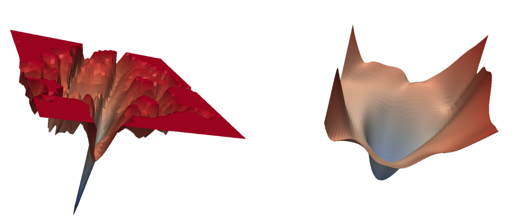

<h1 align="center"><b>(Adaptive) SAM Optimizer</b></h1>
<h3 align="center"><b>Sharpness-Aware Minimization for Efficiently Improving Generalization</b></h3>
<p align="center">
  <i>~ in Pytorch ~</i>
</p> 
 
--------------

<br>

SAM simultaneously minimizes loss value and loss sharpness. In particular, it seeks parameters that lie in **neighborhoods having uniformly low loss**. SAM improves model generalization and yields [SoTA performance for several datasets](https://paperswithcode.com/paper/sharpness-aware-minimization-for-efficiently-1). Additionally, it provides robustness to label noise on par with that provided by SoTA procedures that specifically target learning with noisy labels.

This is an **unofficial** repository for [Sharpness-Aware Minimization for Efficiently Improving Generalization](https://arxiv.org/abs/2010.01412) and [ASAM: Adaptive Sharpness-Aware Minimization for Scale-Invariant Learning of Deep Neural Networks](https://arxiv.org/abs/2102.11600). Implementation-wise, SAM class is a light wrapper that computes the regularized "sharpness-aware" gradient, which is used by the underlying optimizer (such as SGD with momentum). This repository also includes a simple [WRN for Cifar10](example); as a proof-of-concept, it beats the performance of SGD with momentum on this dataset.

<p align="center">
    
</p>

<p align="center">
  <sub><em>ResNet loss landscape at the end of training with and without SAM. Sharpness-aware updates lead to a significantly wider minimum, which then leads to better generalization properties.</em></sub>
</p>

<br>

## Usage

It should be straightforward to use SAM in your training pipeline. Just keep in mind that the training will run twice as slow, because SAM needs two forward-backward passes to estime the "sharpness-aware" gradient. If you're using gradient clipping, make sure to change only the magnitude of gradients, not their direction.

```python
from sam import SAM
...

model = YourModel()
base_optimizer = torch.optim.SGD  # define an optimizer for the "sharpness-aware" update
optimizer = SAM(model.parameters(), base_optimizer, lr=0.1, momentum=0.9)
...

for input, output in data:

  # first forward-backward pass
  loss = loss_function(output, model(input))  # use this loss for any training statistics
  loss.backward()
  optimizer.first_step(zero_grad=True)
  
  # second forward-backward pass
  loss_function(output, model(input)).backward()  # make sure to do a full forward pass
  optimizer.second_step(zero_grad=True)
...
```

<br>

**Alternative usage with a single closure-based `step` function**. This alternative offers similar API to native PyTorch optimizers like LBFGS (kindly suggested by [@rmcavoy](https://github.com/rmcavoy)):

```python
from sam import SAM
...

model = YourModel()
base_optimizer = torch.optim.SGD  # define an optimizer for the "sharpness-aware" update
optimizer = SAM(model.parameters(), base_optimizer, lr=0.1, momentum=0.9)
...

for input, output in data:
  def closure():
    loss = loss_function(output, model(input))
    loss.backward()
    return loss

  loss = loss_function(output, model(input))
  loss.backward()
  optimizer.step(closure)
  optimizer.zero_grad()
...
```

### Training tips
- [@hjq133](https://github.com/hjq133): The suggested usage can potentially cause problems if you use batch normalization. The running statistics are computed in both forward passes, but they should be computed only for the first one. A possible solution is to set BN momentum to zero (kindly suggested by [@ahmdtaha](https://github.com/ahmdtaha)) to bypass the running statistics during the second pass. An example usage is on lines [51](https://github.com/davda54/sam/blob/cdcbdc1574022d3a3c3240da136378c38562d51d/example/train.py#L51) and [58](https://github.com/davda54/sam/blob/cdcbdc1574022d3a3c3240da136378c38562d51d/example/train.py#L58) in [example/train.py](https://github.com/davda54/sam/blob/cdcbdc1574022d3a3c3240da136378c38562d51d/example/train.py):
```python
for batch in dataset.train:
  inputs, targets = (b.to(device) for b in batch)

  # first forward-backward step
  enable_running_stats(model)  # <- this is the important line
  predictions = model(inputs)
  loss = smooth_crossentropy(predictions, targets)
  loss.mean().backward()
  optimizer.first_step(zero_grad=True)

  # second forward-backward step
  disable_running_stats(model)  # <- this is the important line
  smooth_crossentropy(model(inputs), targets).mean().backward()
  optimizer.second_step(zero_grad=True)
```

- [@evanatyourservice](https://github.com/evanatyourservice): If you plan to train on multiple GPUs, the paper states that *"To compute the SAM update when parallelizing across multiple accelerators, we divide each data batch evenly among the accelerators, independently compute the SAM gradient on each accelerator, and average the resulting sub-batch SAM gradients to obtain the final SAM update."* This can be achieved by the following code:
```python
for input, output in data:
  # first forward-backward pass
  loss = loss_function(output, model(input))
  with model.no_sync():  # <- this is the important line
    loss.backward()
  optimizer.first_step(zero_grad=True)
  
  # second forward-backward pass
  loss_function(output, model(input)).backward()
  optimizer.second_step(zero_grad=True)
```
- [@evanatyourservice](https://github.com/evanatyourservice): Adaptive SAM reportedly performs better than the original SAM. The ASAM paper suggests to use higher `rho` for the adaptive updates (~10x larger)

- [@mlaves](https://github.com/mlaves): LR scheduling should be either applied to the base optimizer or you should use SAM with a single `step` call (with a closure):
```python
scheduler = torch.optim.lr_scheduler.CosineAnnealingLR(optimizer.base_optimizer, T_max=200)
```
- [@AlbertoSabater](https://github.com/AlbertoSabater): Integration with Pytorch Lightning — you can write the `training_step` function as:
```python
def training_step(self, batch, batch_idx):
    optimizer = self.optimizers()

    # first forward-backward pass
    loss_1 = self.compute_loss(batch)
    self.manual_backward(loss_1, optimizer)
    optimizer.first_step(zero_grad=True)

    # second forward-backward pass
    loss_2 = self.compute_loss(batch)
    self.manual_backward(loss_2, optimizer)
    optimizer.second_step(zero_grad=True)

    return loss_1
```
<br>


## Documentation

#### `SAM.__init__`

| **Argument**    | **Description** |
| :-------------- | :-------------- |
| `params` (iterable) | iterable of parameters to optimize or dicts defining parameter groups |
| `base_optimizer` (torch.optim.Optimizer) | underlying optimizer that does the "sharpness-aware" update |
| `rho` (float, optional)           | size of the neighborhood for computing the max loss *(default: 0.05)* |
| `adaptive` (bool, optional)       | set this argument to True if you want to use an experimental implementation of element-wise Adaptive SAM *(default: False)* |
| `**kwargs` | keyword arguments passed to the `__init__` method of `base_optimizer` |

<br>

#### `SAM.first_step`

Performs the first optimization step that finds the weights with the highest loss in the local `rho`-neighborhood.

| **Argument**    | **Description** |
| :-------------- | :-------------- |
| `zero_grad` (bool, optional) | set to True if you want to automatically zero-out all gradients after this step *(default: False)* |

<br>

#### `SAM.second_step`

Performs the second optimization step that updates the original weights with the gradient from the (locally) highest point in the loss landscape.

| **Argument**    | **Description** |
| :-------------- | :-------------- |
| `zero_grad` (bool, optional) | set to True if you want to automatically zero-out all gradients after this step *(default: False)* |

<br>

#### `SAM.step`

Performs both optimization steps in a single call. This function is an alternative to explicitly calling `SAM.first_step` and `SAM.second_step`.

| **Argument**    | **Description** |
| :-------------- | :-------------- |
| `closure` (callable) | the closure should do an additional full forward and backward pass on the optimized model *(default: None)* |


<br>

## Experiments

I've verified that SAM works on a simple WRN 16-8 model run on CIFAR10; you can replicate the experiment by running [train.py](example/train.py). The Wide-ResNet is enhanced only by label smoothing and the most basic image augmentations with cutout, so the errors are higher than those in the [SAM paper](https://arxiv.org/abs/2010.01412). Theoretically, you can get even lower errors by running for longer (1800 epochs instead of 200), because SAM shouldn't be as prone to overfitting. SAM uses `rho=0.05`, while ASAM is set to `rho=2.0`, as [suggested by its authors](https://github.com/davda54/sam/issues/37).

| Optimizer             | Test error rate |
| :-------------------- |   -----: |
| SGD + momentum        |   3.20 % |
| SAM + SGD + momentum  |   2.86 % |
| ASAM + SGD + momentum |   2.55 % |
